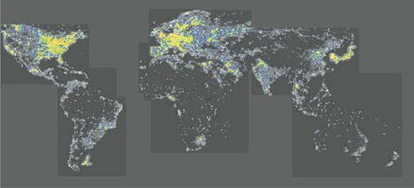
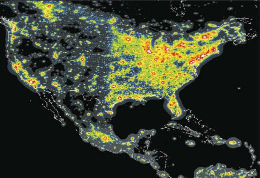

# Gunn Number: 100,000

## Description

relates brightness of stars to brightness of city

original definition of number phrased as lumens: amount of light given off

candelas: amount of light that reaches you

candelas per meter squared (called nits): how bright it actually appears

Gunn Number given as a ratio of nits experienced by an earth observer from a
city compared to all the stars in the sky

## Estimate

### Sky Brightness From Starlight

average sky brightness (estimated from [national solar observatory data](../national_solar_observatory_star_magnitudes/README.md)): 23.12 mag/arcsec^2 or
61.50 μcd/m^2

conversion forumla from brightness `S` in mag/arcsec^2 to brightness `b` μcd/m^2
dervied from

Garstang, R. H. "MODEL FOR ARTIFICIAL NIGHT-SKY ILLUMINATION." *Publications of the Astronomical Society of the Pacific* 98.601 (1986): 364.

Allen, C. W.1973, *Astrophysical Quantities*, 3d ed.; (London: Athlone Press): 26.

### Brightness of City Lights

brightness `b` of a city given by candelas given off by average person times
total population of city divided by land area of city. candelas emitted to sky
given by lumens `L` divided by angular area of sky seen by light `A`. population
divided by land area given by population density `d` recorded [here](../../flora_fauna/2010_census_population_density/README.md)

[Wikipedia](https://en.wikipedia.org/wiki/Lumen_(unit)) gives lumen output of
common lamps between 200 and 4000 lumens. assume 900 geometric mean.

assume average person is responsible for a few lamps, say 3

some lamps see little sky, some see hemisphere. assume 1/6 of a sphere (e.g.
sky is seen through window), which is 2π/3 steradians.

lumen per steradian kilometer squared = micro candela per meter squared

Plugging in 3 * 900 lumens per person and 5000 people per square kilometer
gives number 100,000 times brighter than starlight brightness calculated above.

## Comparison to data

Data from P. Cinzano, F. Falchi, C.D. Elvidge, The first World Atlas of the artificial night sky brightness, *Monthly Notices of the Royal Astronomical Society*, Volume 328, Issue 3, December 2001, Pages 689–707, https://doi.org/10.1046/j.1365-8711.2001.04882.x

### Sky Brightness From Starlight

average sky brightness is 21.6 mag/arcsec^2 or 252 μcd/m^2

about 4 times brighter than estimate. this is explained by scattered sunlight
and light emission of the air itself

### Sky Brightness From City Lights

legend in μcd/m^2:

- blue: 27.7-83.2

- green: 83.2-252

- yellow: 252-756

- orange: 756-2268

- red: 2268-6804

- white: >6804
