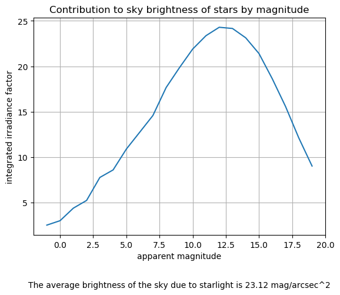

# Number of Stars By Apparent Magnitude

## Description

This table provided by the National Solar Observatory gives the number of stars
in the night sky with at most a given brightness (apparent magnitude). For the
sake of convenience, successive differences have been taken so that the `count`
column gives the number of stars with `apparent magnitude` in the range `(V-1,V]`.

## Key Numbers
The key number to pull from this database is the total luminance of all stars
in the sky. This can be derived by first converting the apparent magnitudes `m`
above into relative irradiance factors `F` using the equation

.

Multiplying these factors by the number of stars of that magnitude and summing
the results gives the integrated irradiance factor of all starlight, which can
be converted back to an integrated magnitude by the reverse equation

.

This can finally be used to compute the brightness `S` of the sky in units of
magnitude per arcseconds squared using the equation

,

where `A` is the total angular area of the sky in arcseconds squared
(4π steradians, or 4π * (180/π)^2 * (3600)^2 arcsec^2).

## Source Information

* **Source Website**: National Solar Observatory, accessed via Wayback Machine
* **URL**: `https://web.archive.org/web/20080206074842/http://www.nso.edu/PR/answerbook/magnitude.html`
* **Bias**: NOT ANNOTATED, likely no bias given nature of website

## Notes
*The original data set was not in tidy format and had to be manually realigned.*

The `count` column in the tidy version of the dataset was calculated manually
by subtracting from the corresponding `cumulative count` value the value of the
row above.
