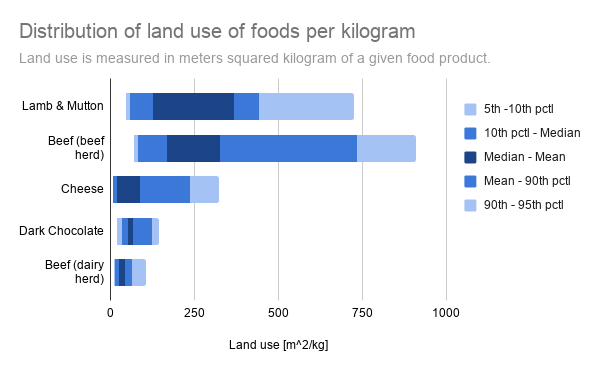
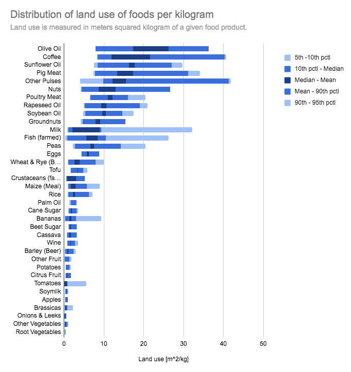

# Land Use for food products per kg (global distribution)

## Description 

This data describes the global distribution of land use for various food products.
The first column shows the food product and the remaining columns show the distribution of 
land use measured in meters squared (m^2) per kilogram
(represented are the 5th percentile, 10th percentile, mean, median, 90th percentile and 95th percentile).

## Key Numbers
This data is related to the Agriculture number, which is the ratio of land use/1000 kcal of beef with land use/1000 kcal of corn. However this data looks at land use in terms of weight instead of energy.

## Source Information

* **Source Website**: Science Magazine
* **URL**: https://science.sciencemag.org/content/360/6392/987/tab-figures-data
* **Bias**: PRO-SCIENCE, VERY HIGH factual reporting

## Notes 
The data is the result of an extensive meta-analysis of food system
impact studies (Poore & Nemecek's 2018: https://science.sciencemag.org/content/360/6392/987)

The authors note the following about the scope of the studies
included in this meta-analysis:
"We derived data from a comprehensive meta-analysis, identifying 1530 studies
for potential inclusion, which were supplemented with additional data received from 139 authors.
Studies were assessed against 11 criteria designed to standardize methodology,
resulting in 570 suitable studies with a median reference year of 2010.
The data set covers ~38,700 commercially viable farms in 119 countries and 40 products
representing ~90% of global protein and calorie consumption'.

 
