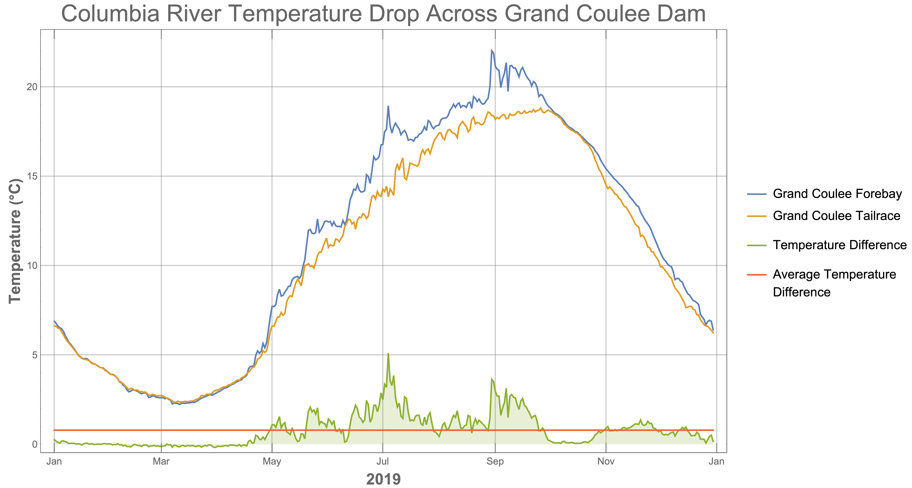

# columbia_river_Grand_Coulee_Dam.csv

## Description

Tidied dataset of the Grand Coulee Dam's forebay and tailrace temperatures (celsius), as well as the difference between them.

## Key Numbers
The temperature difference across the dam is important for computing the numerator of the Carnot number.

## Source Information
* **Source Website**: Columbia Basin Research
* **URL**:
** http://www.cbr.washington.edu/dart/wrapper?type=php&fname=basindata_1591287317_332.php
** http://www.cbr.washington.edu/dart/wrapper?type=php&fname=basindata_1591287688_237.php
* **Bias**: `NOT ANNOTATED`

## Notes
Below is a plot of the dataset.

