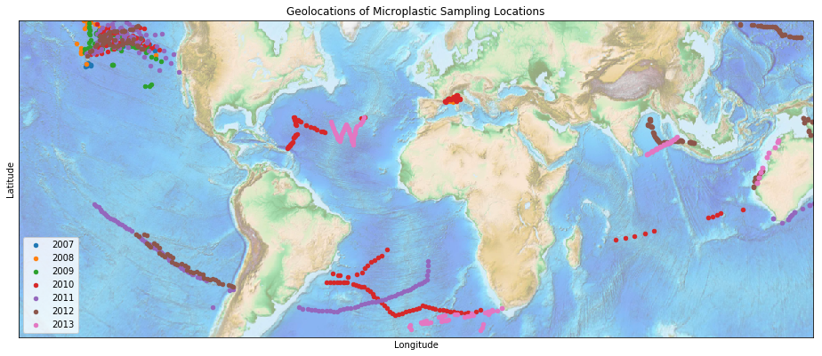
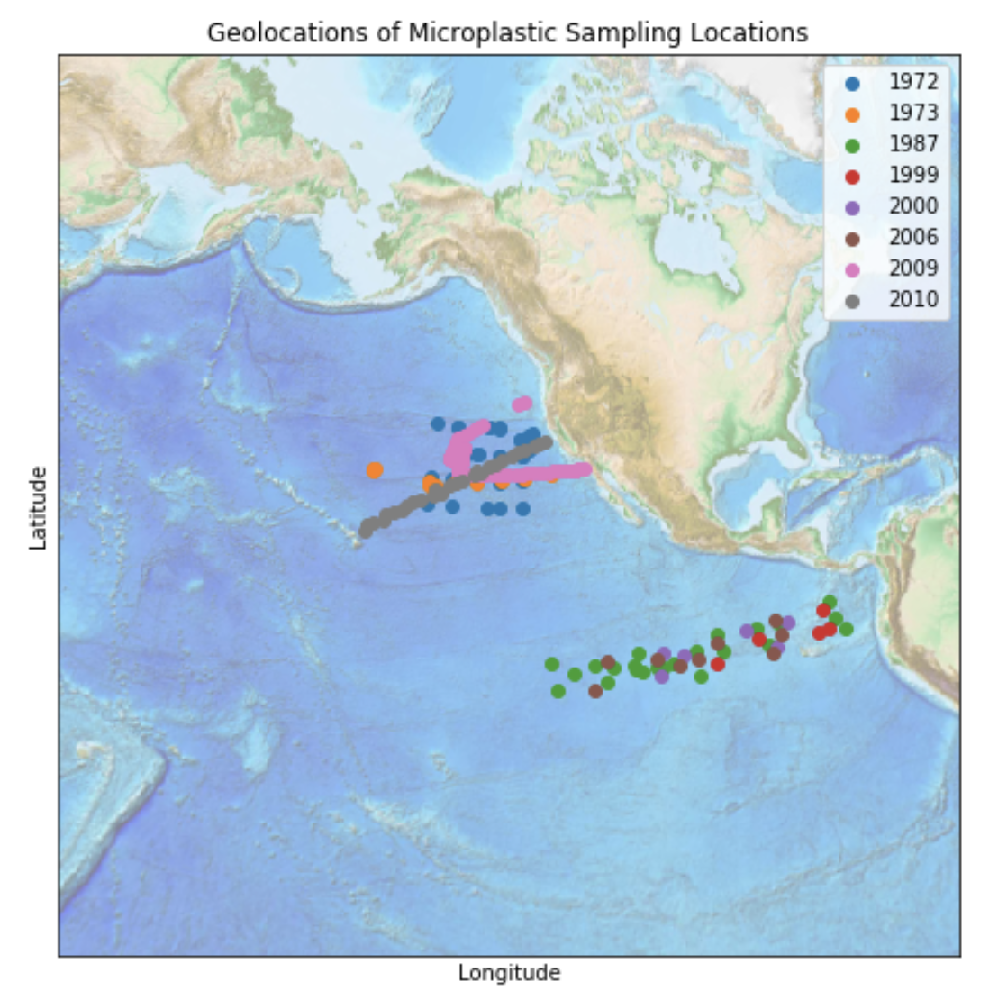

# Garbage in Earth's Oceans

## Description

The Plastic Marine Pollution datasets and its Our World in Data derivatives
are based on expeditions from 2007 - 2013.  They survey all major ocean
gyre systems (North Pacific, North Atlantic, South Pacific, South Atlantic,
Indian Ocean), as well as extensive coastal regions and enclosed seas (Bay 
of Bengal, Aus-tralian coasts and the Mediterranean Sea).  These 
expeditions use a combination of surface net tows and  visual survey 
transects for large plastic debris to sample how much trash is in the 
ocean.  These surveyers then sort the plastics they find into certain 
sizes, roughly dividing into macroplastics and microplastics, before 
determining the weight of the plastics for each size group.  The 
Microplastic Numerical and Mass Concentration dataset was calculated in a 
similar manner by using plankton net tows to collect microplastic debris, 
however only sampled over the two pacific gyres (Northern and Southern
Pacific).

However for both datasets, there is bias towards sampling the 
Northern Pacific gyre. Looking at the geolocations recorded from 
each sampling location illustrates the bias towards sampling the
Northern Pacific gyre, for both datasets.

## Source Info

1. PLOS ONE. https://figshare.com/articles/Plastic_Marine_Pollution_Global_Dataset/1015289

2. UCSD. https://oceaninformatics.ucsd.edu/datazoo/catalogs/ccelter/datasets/213/datatables/213/download

3. Our World In Data. https://ourworldindata.org/where-does-plastic-accumulate

## Key Numbers

Used to estimate the equivalent surface area of garbage in the oceans.

## References

  1. Ritchie, Hannah. 
  Where does our plastic accumulate in the ocean and what does that 
  mean for the future? 
  Our World in Data (2019). https://ourworldindata.org/where-does-plastic-accumulate. 

  2. Eakins, B.W. and G.F. Sharman, 
  Volumes of the World's Oceans from ETOPO1,
  NOAA National Geophysical Data Center, Boulder, CO, 2010. 
  https://www.ngdc.noaa.gov/mgg/global/etopo1_ocean_volumes.html. 

  3. Lebreton, L., Slat, B., Ferrari, F. et al. 
  Evidence that the Great Pacific Garbage Patch is rapidly 
  accumulating plastic. Sci Rep 8, 4666 (2018). 
  https://doi.org/10.1038/s41598-018-22939-w

  4. Eriksen, Marcus; Reisser, Julia; Galgani, Francois; Moore, Charles; 
  Ryan, Peter; Carson, Hank; Thiel, Martin (2014): 
  Plastic Marine Pollution Global Dataset. 
  figshare. http://dx.doi.org/10.6084/m9.figshare.1015289. 

  5. Law, Kara Lavender; Moret-Ferguson, Skye E.; Goodwin, Deborah S.;
  Zettler, Erik R.; DeForce, Emelia; Kukulka, Tobias; Proskurowski, Giora.
  Distribution of Surface Plastic Debris in the Eastern Pacific Ocean from an
  11-Year Data Set. Environ. Sci Technol Vol 48, 9, 4732-4738 (2014). 
  https://doi.org/10.1021/es4053076. 

  6. Min, K., Cuiffi, J.D. & Mathers, R.T. 
  Ranking environmental degradation trends of plastic marine debris 
  based on physical properties and molecular structure. 
  Nat Commun 11, 727 (2020). https://doi.org/10.1038/s41467-020-14538-z
